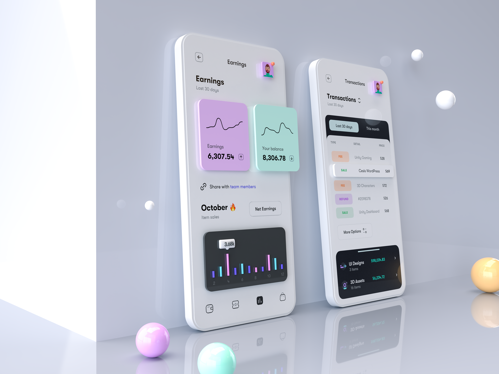
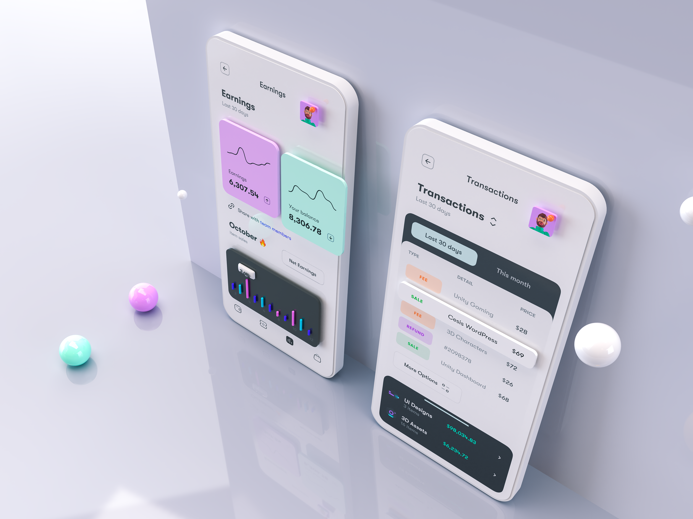

# Introduction

If you have design, hold your apk too ! contact me at sanjeevmadhav03@gmail.com.

# Inspiration

> Inspired from this beautiful dribbble shot [Simple Phone Mockup for Anaylytics UI](https://dribbble.com/shots/14442583-Simple-Phone-Mockup-for-Anaylytics-UI?utm_source=Clipboard_Shot&utm_campaign=tranmautritam&utm_content=Simple%20Phone%20Mockup%20for%20Anaylytics%20UI&utm_medium=Social_Share) by Tran Mau Tri Tam

# Preview

